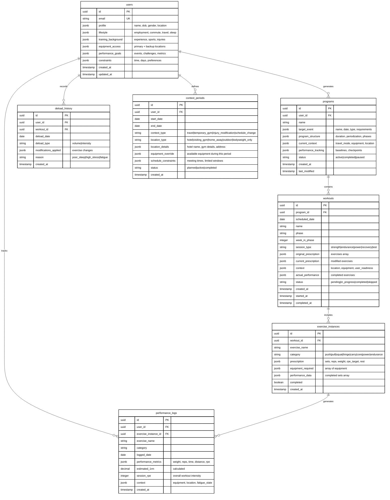

# Database Schema Design
## Supabase PostgreSQL Schema for S&C Program Generator

**Status**: 🔄 IN PROGRESS  
**Purpose**: Minimal but complete schema supporting event-driven program generation

---

## 📋 Schema Design Checklist

### Core Tables
- [ ] **users** - Auth + comprehensive profile data
- [ ] **programs** - Event-driven periodized programs  
- [ ] **workouts** - Daily adaptive workouts with deload tracking
- [ ] **exercise_instances** - Specific exercises within workouts
- [ ] **performance_logs** - Exercise performance tracking
- [ ] **deload_history** - Deload frequency enforcement
- [ ] **context_periods** - Travel sessions & temporary context changes

### Relationships & Constraints
- [ ] Set up foreign key relationships
- [ ] Add check constraints for data validation
- [ ] Create composite indexes for performance
- [ ] Configure cascading deletes appropriately

### Security (Row Level Security)
- [ ] Enable RLS on all tables
- [ ] Create user-specific policies
- [ ] Restrict access to own data only
- [ ] Allow public read for exercise reference data

### Performance Optimizations  
- [ ] Index frequently queried columns
- [ ] Create composite indexes for analytics queries
- [ ] Add partial indexes where appropriate
- [ ] Set up materialized views for analytics

---

## 🏗️ Database Schema Architecture

### Design Principles

**1. Minimal Complexity** - No over-normalization that would require complex joins for simple API calls

**2. Event-Driven Focus** - Schema optimized for reverse periodization from target events

**3. Analytics-First** - Structure supports efficient analytics queries without complex aggregations  

**4. Context-Aware** - Flexible enough to handle travel mode, equipment changes, injury modifications

**5. Performance-Focused** - Indexed for fast retrieval of user's current program and workout data

---

## 📊 Schema Diagram



---

## 📋 Table Specifications

### users table
```sql
CREATE TABLE users (
  id UUID PRIMARY KEY DEFAULT gen_random_uuid(),
  email TEXT UNIQUE NOT NULL,
  
  -- Use JSONB for flexible, nested data that changes infrequently
  profile JSONB NOT NULL DEFAULT '{}',
  lifestyle JSONB NOT NULL DEFAULT '{}',
  training_background JSONB NOT NULL DEFAULT '{}', 
  equipment_access JSONB NOT NULL DEFAULT '{}',
  performance_goals JSONB NOT NULL DEFAULT '{}',
  constraints JSONB NOT NULL DEFAULT '{}',
  
  created_at TIMESTAMP WITH TIME ZONE DEFAULT NOW(),
  updated_at TIMESTAMP WITH TIME ZONE DEFAULT NOW()
);
```

### programs table  
```sql
CREATE TABLE programs (
  id UUID PRIMARY KEY DEFAULT gen_random_uuid(),
  user_id UUID REFERENCES users(id) ON DELETE CASCADE,
  name TEXT NOT NULL,
  
  target_event JSONB NOT NULL, -- event details driving program design
  program_structure JSONB NOT NULL, -- periodization model, phases
  current_context JSONB DEFAULT '{}', -- travel, equipment state
  performance_tracking JSONB DEFAULT '{}', -- baselines, checkpoints
  
  status TEXT DEFAULT 'active' CHECK (status IN ('active', 'completed', 'paused', 'regenerating')),
  
  created_at TIMESTAMP WITH TIME ZONE DEFAULT NOW(),
  last_modified TIMESTAMP WITH TIME ZONE DEFAULT NOW()
);
```

### workouts table
```sql
CREATE TABLE workouts (
  id UUID PRIMARY KEY DEFAULT gen_random_uuid(),
  program_id UUID REFERENCES programs(id) ON DELETE CASCADE,
  scheduled_date DATE NOT NULL,
  name TEXT NOT NULL,
  phase TEXT NOT NULL,
  week_in_phase INTEGER NOT NULL,
  session_type TEXT NOT NULL CHECK (session_type IN ('strength', 'endurance', 'power', 'recovery', 'test')),
  
  original_prescription JSONB NOT NULL, -- AI-generated workout
  current_prescription JSONB NOT NULL,  -- may include deloads/modifications
  context JSONB DEFAULT '{}', -- location, equipment, readiness
  actual_performance JSONB DEFAULT '{}', -- what actually happened
  
  status TEXT DEFAULT 'pending' CHECK (status IN ('pending', 'in_progress', 'completed', 'skipped', 'modified')),
  
  created_at TIMESTAMP WITH TIME ZONE DEFAULT NOW(),
  started_at TIMESTAMP WITH TIME ZONE,
  completed_at TIMESTAMP WITH TIME ZONE
);
```

### exercise_instances table
```sql
CREATE TABLE exercise_instances (
  id UUID PRIMARY KEY DEFAULT gen_random_uuid(),
  workout_id UUID REFERENCES workouts(id) ON DELETE CASCADE,
  exercise_name TEXT NOT NULL,
  category TEXT NOT NULL,
  
  prescription JSONB NOT NULL, -- sets, reps, weight, rpe target
  equipment_required JSONB DEFAULT '[]',
  performance_data JSONB DEFAULT '{}', -- actual sets completed
  
  completed BOOLEAN DEFAULT FALSE,
  created_at TIMESTAMP WITH TIME ZONE DEFAULT NOW()
);
```

### performance_logs table  
```sql
CREATE TABLE performance_logs (
  id UUID PRIMARY KEY DEFAULT gen_random_uuid(),
  user_id UUID REFERENCES users(id) ON DELETE CASCADE,
  exercise_instance_id UUID REFERENCES exercise_instances(id) ON DELETE SET NULL,
  
  exercise_name TEXT NOT NULL,
  category TEXT NOT NULL,
  logged_date DATE NOT NULL,
  
  performance_metrics JSONB NOT NULL, -- weight, reps, time, distance, rpe
  estimated_1rm DECIMAL(5,2), -- calculated from performance
  session_rpe INTEGER CHECK (session_rpe BETWEEN 1 AND 10),
  context JSONB DEFAULT '{}', -- equipment, location, fatigue state
  
  created_at TIMESTAMP WITH TIME ZONE DEFAULT NOW()
);
```

### deload_history table
```sql  
CREATE TABLE deload_history (
  id UUID PRIMARY KEY DEFAULT gen_random_uuid(),
  user_id UUID REFERENCES users(id) ON DELETE CASCADE,
  workout_id UUID REFERENCES workouts(id) ON DELETE CASCADE,
  
  deload_date DATE NOT NULL,
  deload_type TEXT NOT NULL CHECK (deload_type IN ('volume', 'intensity')),
  modifications_applied JSONB NOT NULL,
  reason TEXT NOT NULL,
  
  created_at TIMESTAMP WITH TIME ZONE DEFAULT NOW()
);
```

### context_periods table
```sql
CREATE TABLE context_periods (
  id UUID PRIMARY KEY DEFAULT gen_random_uuid(),
  user_id UUID REFERENCES users(id) ON DELETE CASCADE,
  
  -- Time boundaries for context application
  start_date DATE NOT NULL,
  end_date DATE NOT NULL,
  
  -- Context type and details
  context_type TEXT NOT NULL CHECK (context_type IN ('travel', 'temporary_gym', 'injury_modification', 'schedule_change')),
  location_type TEXT NOT NULL CHECK (location_type IN ('hotel', 'visiting_gym', 'home_away', 'outdoor', 'bodyweight_only')),
  
  -- Flexible context data
  location_details JSONB DEFAULT '{}', -- hotel name, gym address, contact info
  equipment_override JSONB NOT NULL, -- specific equipment available during this period  
  schedule_constraints JSONB DEFAULT '{}', -- meeting times, workout windows, timezone
  
  -- Status tracking
  status TEXT DEFAULT 'planned' CHECK (status IN ('planned', 'active', 'completed', 'cancelled')),
  
  created_at TIMESTAMP WITH TIME ZONE DEFAULT NOW(),
  
  -- Ensure date ranges are valid
  CONSTRAINT valid_date_range CHECK (end_date >= start_date)
);
```

---

## 🔐 Row Level Security (RLS) Policies

### Enable RLS on all tables
```sql
ALTER TABLE users ENABLE ROW LEVEL SECURITY;
ALTER TABLE programs ENABLE ROW LEVEL SECURITY;  
ALTER TABLE workouts ENABLE ROW LEVEL SECURITY;
ALTER TABLE exercise_instances ENABLE ROW LEVEL SECURITY;
ALTER TABLE performance_logs ENABLE ROW LEVEL SECURITY;
ALTER TABLE deload_history ENABLE ROW LEVEL SECURITY;
ALTER TABLE context_periods ENABLE ROW LEVEL SECURITY;
```

### User-specific access policies
```sql
-- Users can only access their own data
CREATE POLICY "Users can view own profile" ON users FOR SELECT USING (auth.uid() = id);
CREATE POLICY "Users can update own profile" ON users FOR UPDATE USING (auth.uid() = id);

-- Programs owned by user
CREATE POLICY "Users can access own programs" ON programs FOR ALL USING (user_id = auth.uid());

-- Workouts through program ownership
CREATE POLICY "Users can access own workouts" ON workouts FOR ALL USING (
  program_id IN (SELECT id FROM programs WHERE user_id = auth.uid())
);

-- Exercise instances through workout ownership  
CREATE POLICY "Users can access own exercise instances" ON exercise_instances FOR ALL USING (
  workout_id IN (
    SELECT w.id FROM workouts w 
    JOIN programs p ON w.program_id = p.id 
    WHERE p.user_id = auth.uid()
  )
);

-- Performance logs owned by user
CREATE POLICY "Users can access own performance data" ON performance_logs FOR ALL USING (user_id = auth.uid());

-- Deload history owned by user
CREATE POLICY "Users can access own deload history" ON deload_history FOR ALL USING (user_id = auth.uid());

-- Context periods owned by user  
CREATE POLICY "Users can access own context periods" ON context_periods FOR ALL USING (user_id = auth.uid());
```

---

## 📈 Indexes for Performance

### Primary query patterns indexes
```sql
-- User's current active program
CREATE INDEX idx_programs_user_active ON programs(user_id, status) WHERE status = 'active';

-- Today's workout lookup (most frequent query)
CREATE INDEX idx_workouts_program_date ON workouts(program_id, scheduled_date);

-- Exercise instances for workout
CREATE INDEX idx_exercise_instances_workout ON exercise_instances(workout_id);

-- Performance analytics queries
CREATE INDEX idx_performance_user_exercise_date ON performance_logs(user_id, exercise_name, logged_date);

-- Deload frequency enforcement  
CREATE INDEX idx_deload_history_user_date ON deload_history(user_id, deload_date DESC);

-- Context period lookups (find active context for date)
CREATE INDEX idx_context_periods_user_dates ON context_periods(user_id, start_date, end_date) WHERE status = 'active';
```

### Analytics-optimized composite indexes
```sql
-- Event progress analytics
CREATE INDEX idx_performance_user_category_date ON performance_logs(user_id, category, logged_date);

-- Exercise-specific progression
CREATE INDEX idx_performance_exercise_progression ON performance_logs(user_id, exercise_name, logged_date, estimated_1rm);
```

---

## ⚡ Database Functions & Triggers

### Auto-update timestamps
```sql
CREATE OR REPLACE FUNCTION update_updated_at_column()
RETURNS TRIGGER AS $$
BEGIN
  NEW.updated_at = NOW();
  RETURN NEW;
END;
$$ language 'plpgsql';

CREATE TRIGGER update_users_updated_at BEFORE UPDATE ON users
  FOR EACH ROW EXECUTE FUNCTION update_updated_at_column();

CREATE TRIGGER update_programs_updated_at BEFORE UPDATE ON programs
  FOR EACH ROW EXECUTE FUNCTION update_updated_at_column();
```

### Deload frequency validation  
```sql
CREATE OR REPLACE FUNCTION check_deload_frequency()
RETURNS TRIGGER AS $$
BEGIN
  -- Ensure max 1 deload per 6 training days
  IF (
    SELECT COUNT(*) 
    FROM deload_history 
    WHERE user_id = NEW.user_id 
    AND deload_date >= NEW.deload_date - INTERVAL '6 days'
  ) >= 1 THEN
    RAISE EXCEPTION 'Maximum deload frequency exceeded: 1 per 6 training days';
  END IF;
  
  RETURN NEW;
END;
$$ language 'plpgsql';

CREATE TRIGGER validate_deload_frequency 
  BEFORE INSERT ON deload_history
  FOR EACH ROW EXECUTE FUNCTION check_deload_frequency();
```

---

## 🎯 Schema Design Rationale

### Why JSONB Over Normalized Tables?

**User Profile Data**: Changes infrequently, queried as complete objects, benefits from flexible schema
**Program Structure**: Complex nested data (phases, periodization), retrieved as complete programs
**Workout Prescriptions**: Variable exercise structures, modified as units, not individual fields

### Why Separate performance_logs?

**Analytics Queries**: Need fast aggregation across time periods and exercise types
**High Volume**: Will grow much larger than other tables, needs separate indexing strategy  
**Flexible Metrics**: Different exercises track different metrics (weight vs time vs distance)

### Why deload_history Table?

**Business Logic Enforcement**: Critical feature requiring database-level validation
**Analytics**: Need to track deload patterns for program optimization
**Audit Trail**: Important for understanding user fatigue and adaptation patterns

### Why context_periods Table?

**Multiple Concurrent Contexts**: Users need to plan multiple travel periods during long programs
**Time-Bounded Overrides**: Equipment/schedule changes apply only during specific date ranges
**Location-Specific Equipment**: Different hotels/gyms have different equipment combinations
**Schedule Flexibility**: Business meetings, family obligations affect workout timing
**Audit Trail**: Track why workouts were modified (travel vs injury vs schedule conflict)

---

## ✅ Implementation Checklist

### Phase 1: Core Schema
- [ ] Create tables with proper data types
- [ ] Add foreign key relationships
- [ ] Set up check constraints
- [ ] Enable Row Level Security

### Phase 2: Security & Access  
- [ ] Create RLS policies for all tables
- [ ] Test user isolation
- [ ] Verify cascade deletes work correctly
- [ ] Add auth trigger functions

### Phase 3: Performance
- [ ] Create primary indexes
- [ ] Add composite indexes for analytics
- [ ] Test query performance
- [ ] Set up monitoring

### Phase 4: Validation
- [ ] Add business logic triggers
- [ ] Create database functions
- [ ] Test deload frequency enforcement
- [ ] Validate data integrity constraints

---

**Next Step**: Implement this schema in Supabase Dashboard, then generate migration files for version control.